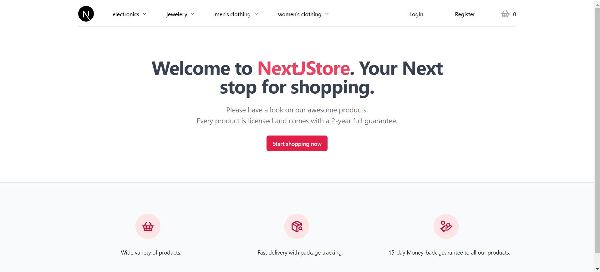

<h1 align="center">Welcome to NextJStore 📣</h1>

<h3 align="center">A full-stack digital marketplace ready to welcome your awesome products! 👕 </h3>

<strong>Deployment link (Vercel):</strong> https://nextjstore-six.vercel.app/

  

 

    
    
    
    
    

## Inspiration

The project's client components (frontend) and project's structure are mostly inspired by <a href="https://www.youtube.com/watch?v=06g6YJ6JCJU&t=39401s">this</a> project from <a href="https://github.com/joschan21">joschan21</a>. However, a whole different approach was followed on the backend, CMS and database implementation involving WordPress plugins and built-in RestAPI.

## Purpose

This web application combines the flexibility in development of a full-stack React framework like NextJS (assisted with Tailwind for fast and well-structured styles) with the ability to configure and control the backend and the database with a popular and fully-supported CMS like WordPress. The result demonstrates my general knowledge on front-end development (building UIs, adding styles, creating responsive components etc.), on WordPress (configuring the necessary plugins according to the project's needs and requesting data through RestAPI endpoints) and on basic aspects of React-NextJS (creating/using default/custom hooks, implementing global state, using NextJS app router with both client and API routes etc.)

## Features

NextJStore's main features are:

-  Product browsing and Cart functionality (visitors can browse already uploaded store's products (from FakeStoreAPI or other users) and add them to their cart through /products route)

-  User Authentication (visitors can create an account, verify them through submitted email address, login with unique session cookie and reset their lost password)

-  User Roles/Authorization (users, according to their user role, have limited access to the project's routes and features to ensure normal functionality of the web app. For example, only seller role users can submit a product for sale, only non-seller users can submit a seller application and logged in users cannot reach /login or /register routes)

-  Submit a Product (users with seller user role can apply to submit a new product for sale on NextJStore. The administrator checks the product on the CMS and only when it is accepted the product gets added in the platform. The user gets notified on his/her application through the user dashboard)
  
- Use site's contact forms to apply for seller user role and submit a review for the site (the administrator gets notified by email when the visitor submits successfully one of the 2 contact forms)

## Usage

In order to try out the project yourself, you can do the following steps to get the most out of the project's features:\

-  Browse NextJStore's already uploaded products through /products route

-  Create an account on /register route and login on the account you created using /login route (you can also reset your password if you want to see if that feature works too). After that, on the navbar you will see "My Account" item with only one option (Log out). If you visit your registered email and verify your registration, you will see a second option "Become a Seller"

-  Apply for seller user role, after you verify your registered email address, on /become-a-seller route. Complete the form and the admin will change your role to seller, so you can start uploading products
  
- On "My Account" item there is now a third option (My products). Visit this route and you will be prompted to visit /sell route to submit your very first product. Your product will not be uploaded until the administrator approves your submit. You can check your application's status on "My products" option of the user menu.
  
- If your product gets accepted status, you will see it live on /products route. Feel free to add some of the products to your cart, press the "Continue to checkout" button and give an honest review of your user experience

## Development

NextJStore achieves the implementation of the features mentioned above, by using the following technologies/practices:

  -  User Authentication: Use of API routes of NextJS along with WP JWT-Auth token creation plugin to create a unique session token from the user database
    
  -  User Authorization: Authorization according to user's role is applied through middleware feature of NextJS on <code>middleware.ts</code> file
    
  -  Products: Products are uploaded on NextJStore using 2 ways. The first way is fetching default products from <a href="https://fakestoreapi.com/">FakeStoreAPI</a> and the second way is fetching user uploaded products from CMS (using WP RestAPI). User product is a custom WordPress post type designed using Advanced Custom Fields (ACF) plugin
    
  - Cart: Cart functionality is implemented using zustand state management library. The cart's content gets stored on local storage and does not get deleted if the user changes/refreshses route or logs in

## Roadmap

-  Change the UI of the Admin's Dashboard (WordPress dashboard) so it looks more like the project's CMS than a common WordPress site

-  Create User Reviews and Seller role applications custom fields to store them at the CMS instead of an email to the admin 

## Contributing

Please feel free to contribute to this project by forking this repo or letting me know about your opinion and/or suggestions on the project. If you want a local copy of the CMS, contact me on my email or LinkedIn.

## Contributors

<a href="https://github.com/joschan21">joschan21</a>: His digitalhippo project inspired me on the front-end (client components) of the site and its general structure

## License

This project is under the MIT License.
